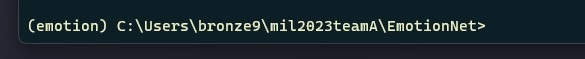

# 한국인 감정인식 딥러닝 모델을 활용한 군 부대 조직 관리 시스템 (2023 대한전자공학회 하계학술대회)

# Facial Emotion Recognition

## 환경 설정
- 아나콘다 설치 (가상환경)
  - https://somjang.tistory.com/entry/Windows-Windows%EC%97%90%EC%84%9C-Anaconda-%EC%84%A4%EC%B9%98%ED%95%98%EA%B8%B0
- CUDA, CUDNN 설치 (GPU 사용을 위해)
  - https://donggyu-oh.tistory.com/2
- 자신의 CUDA 버전에 맞는 pytorch 설치 https://pytorch.org/get-started/previous-versions/
- 실행화면



```python
# Clone Repository
git clone https://github.com/tiruss/mil2023teamA.git
cd mil2023teamA/EmotionNet
# 가상환경 생성
conda create -n emotion python=3.9
# 가상환경 실행
conda activate emotion
# CUDA 11.7 기준 예시
pip install torch torchvision torchaudio --index-url https://download.pytorch.org/whl/cu117
# 기타 라이브러리 설치
pip install -r reqiurements.txt
```

## 데이터 다운로드
- 구글 드라이브 링크 접속 [LINK](https://drive.google.com/drive/folders/14MVJA578jqM27MU5yzM8bTqk39INbG24?usp=share_link)
- "data" 폴더 내 "cau.zip", "ai_hub.zip" 압축파일 다운로드 및 압축 해제
- 폴더 구성
```
data
|___ai_hub
|   |___train
|   |___val
|   |___test
|___cau
|   |___train
|   |___val
|train_cau.py
...
```

## 데이터 학습

```python
python train_cau.py --model "MODEL_NAME" --image_size "Image SIZE" --model_path "OUTPUT_MODEL_NAME" --image_channel "1 or 3"
```
- MODEL_NAME : vgg19, resnet18, emotionnet, efficientnet-b4
- Image SIZE : cnn, resnet, vgg19, vgg22: 48 | vgg24: 96 | efficientnet: 224, any
- OUTPUT_MODEL_NAME : 모델 저장 이름
- 1 or 3 : 모델에 따라 다름, 3 for efficientnet, 1 for the rest

```python
# vgg19 경우
python train_cau.py --model "vgg19" --image_size 48 --model_path "vggNet_cau.pt" --image_channel 1
# ResNet 경우
python train_cau.py --model "resnet18" --image_size 48 --model_path "resNet_cau.pt" --image_channel 1
# efficientnet 경우
python train_cau.py --model "efficientnet-b4" --image_size 224 --model_path "efficientNet_cau.pt" --image_channel 3
```

## 학습 결과

```python
python test-efficientnet.py [args]
```

- /data/test 데이터를 바탕으로 모델의 정확도를 평가할 수 있다.
- 입력 파라미터(기본값)는 다음과 같이 설정되어 있다.

  - --model_path (model.pt): 학습한 결과를 저장할 모델의 파일명
  - --data_path (data): test set이 위치한 폴더
  - --batch_size (128): 배치의 크기 설정
  - --image_size (48): 이미지 리사이즈 크기
  - --image_channel (1): 이미지 채널 크기 

## 데이터셋 이미지 정보

- 얼굴 표정 데이터는 크게 "연기자" 데이터와 "일반인" 데이터로 구성되어 있으며 그 비율은 약 5:5로 되어 있음
- 얼굴 표정은 ['기쁨', '당황', '분노', '불안', '상처', '슬픔', '중립’] 7개로 분류됨
- 메타데이터로는 3명의 작업자가 판단한 얼굴 표정, 이미지에서 얼굴이 위치한 영역, 배경 정보가 포함되어 있음

주어진 TSV(tab-separated variables)는 다음과 같은 컬럼들로 구성되어 있다.

```
name
url	TaskA_emotion
TaskB_emotion
TaskC_emotion
TaskA_background
TaskB_background
TaskC_background
TaskA_result
TaskB_result
TaskC_result
```


## 학습한 얼굴 표정 인식 모델 사용 예시 및 결과

```sh
$ python emotion.py --img happy.jpg
[{'label': '기쁨', 'probs': [0.0, 0.0, 1.16, 0.09, 0.27, 98.48, 0.0]}]
```

- 결과 양식은 JSON string이며, emotion에 얼굴 표정 감정에 대한 prediction 결과를 담고 있다.
- 얼굴 표정 인식 모델은 얼굴 이미지를 대상으로 수행되며, 입력 이미지는 얼굴 영역을 자른 이미지를 입력한다.
- 얼굴 영역을 찾는 face detaction은 본 프로젝트의 범위는 아니지만, 해당 기능을 옵션을 통해 추가 수행할 수 있으며, Haar Cascade Face Classifier를 사용할 수 있도록 제공한다.

  - Haar Cacade Face Classifier

    https://opencv-python-tutroals.readthedocs.io/en/latest/py_tutorials/py_objdetect/py_face_detection/py_face_detection.html


- 입력 파라미터(기본값)는 다음과 같이 설정되어 있다.

  - --img (기쁨.jpg): 입력 이미지 파일명
  - --model_path (model.pt): 얼굴 표정 인식 모델의 파일명
  - --gpu (True): 시스템에 GPU가 지원되는 경우, GPU를 사용하는지 여부
  - --detect_face (False): 입력 이미지가 얼굴 표정만 담긴 이미지가 아닐 경우, face detection을 진행

    - 옵션이 켜지면 출력에 검출된 얼굴 영역 정보가 다음과 같이 함께 기록된다.

    ```sh
    $ python emotion.py --img sample.jpg --detect_face
    [{'rect': '(886, 292, 1324, 1324)', 'label': '기쁨', 'probs': [0.0, 0.0, 1.16, 0.09, 0.27, 98.48, 0.0]}]
    ```

    - rect (x, y, w, h) 는 얼굴 영역에 대한 prediction 결과를 담고 있다.
    - 이미지에서 얼굴 영역을 찾을 수 없는 경우, 입력 이미지 전체를 얼굴 이미지로 가정하고 얼굴 표정 인식을 진행한다.
    - 이미지에서 복수의 얼굴을 찾은 경우, 이에 대한 얼굴 표정 인식 결과를 list로 출력한다.

## 실시간 비디오 표정 인식

```sh
$ python video.py
```

* 영상을 입력 받을 수 있는 카메라가 연결되어 있을 경우, 카메라로 입력되는 영상에 대해 얼굴 표정 인식을 수행할 수 있다.

